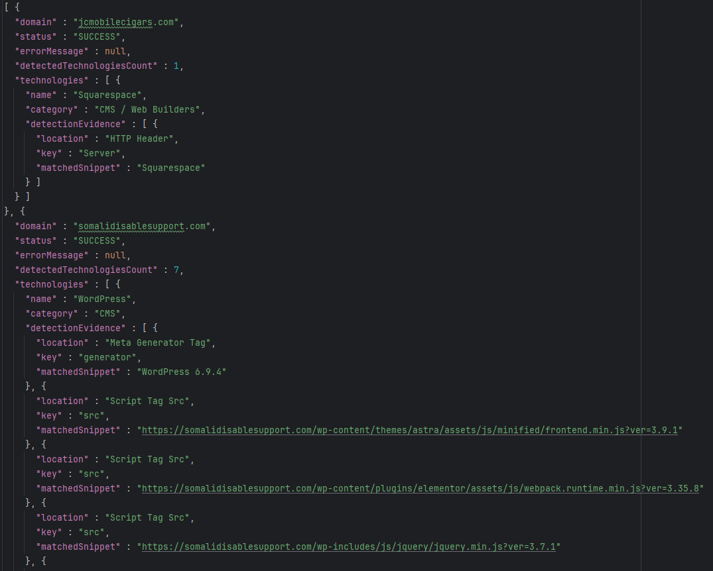
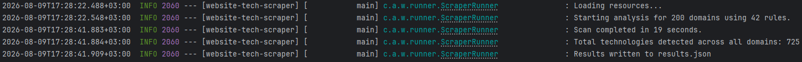

<h1 align="center"><strong>Website Technologies Scraper</strong></h1>

Website Technologies Scraper is an application for detecting web technologies on domains, built with Spring Boot and Jsoup

## How to run the app

- **Run:**
   ```bash
   ./mvnw spring-boot:run

## Features
- Scans multiple domains at the same time using a thread pool.
- Matches technologies using a flexible JSON rules file (checks HTTP headers, meta tags, and scripts).
- Generates a `results.json` report and 725 technologies detected.

## Tech Stack
- **Language:** Java 21
- **Framework:** Spring Boot
- **Parsing:** Jsoup
- **Testing:** JUnit, Mockito

## Demonstration
<p align="center">
   <em>Results File</em>
   <br>
   <br>
   
</p>

<p align="center">
   <em>Technologies Detected</em>
   <br>
   <br>
   
</p>

## Debate Topics

**1. What were the main issues with your current implementation and how would you tackle them?**
The main issue is that `Jsoup` only reads static HTML. It cannot execute JavaScript, so it misses technologies that load dynamically on the page. Also, some websites easily block the scraper. To fix this, I would use a browser automation tool (like Selenium) to render the full page, and I would add delays between requests so the script doesn't look like a bot.

**2. How would you scale this solution for millions of domains crawled in a timely manner (1-2 months)?**
To scale it, I would upload the Spring Boot app to multiple cloud servers and divide the domain list between them. Instead of a file, I would connect all the servers to a real database (like PostgreSQL) to save the results at the same time.

**3. How would you discover new technologies in the future?**
The easiest way is to regularly check open-source lists like Wappalyzer and copy their new rules. Another idea is to save all the `<script src="...">` links that my tool doesn't recognize. If I see the same unknown link on hundreds of websites, I can manually investigate it and add it as a new rule.
